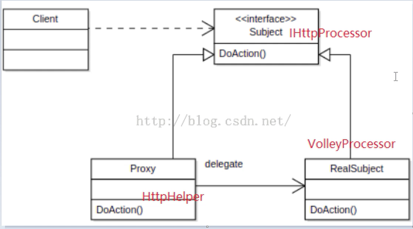

# 一个网络切换框架
> 这是一个demo级别的网络切换框架，关键在于学习架构思想，采用了代理设计模式。


> 在app开发过程中，如果直接使用三方网络框架，遇到问题需要切换框架时，可能需要修改每一个网络访问点，如果我们对网络框架进行一定的封装，只需要一句代码就可以实现切换，同理可以应用于图片加载等三方框架。

## 如何切换
```java
package cn.zgy.httpprocessor;

import android.app.Application;

import cn.zgy.processor.HttpHelper;
import cn.zgy.processor.HttpProcessor.OkHttpProcessor;
import cn.zgy.processor.HttpProcessor.VolleyProcessor;

public class MyApplication extends Application {

    @Override
    public void onCreate() {
        super.onCreate();
        //切换代码
//        HttpHelper.init(new VolleyProcessor(this));
        HttpHelper.init(new OkHttpProcessor());
    }
}

```

HttpHelper: 代理类
ICallback：自定义回调接口
HttpCallback：回调实现类
IHttpProcessor：自定义代理接口
OkHttpProcessor：okhttp实现类
VolleyProcessor：volley实现类


如何调用：

```java
HttpHelper.obtain().post(url, params, new HttpCallback<Entity>() {
            @Override
            public void onFail(String e) {
                Log.e("网络失败", e.toString());
            }

            @Override
            public void onSuccess(Entity entity) {
                Log.e("TGA", entity.toString());
            }
        });
```